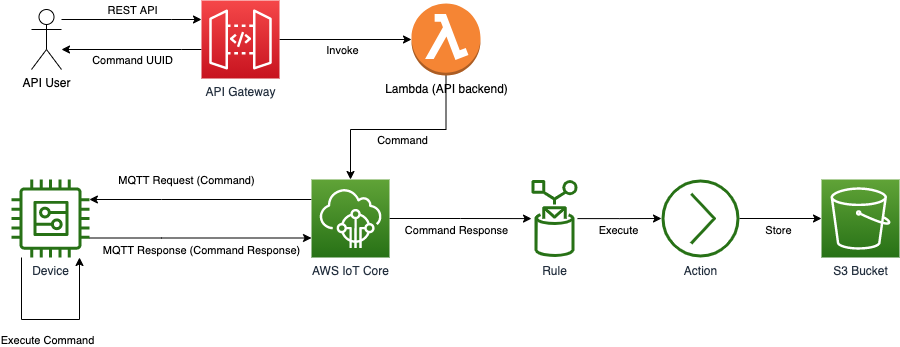

# D2T1

This is a simple demo ilustrating how to connect a REST API with a device via AWS IoT Core. 

The API accepts a command that will be "forwarded" to a device using MQTT PUBLISH and the device will process the cmd and send the response back to IoT Core on a different topic. It will also return back to client a UUID to identify the request and track the results of its processing.

Finally, IoT Core will process the response from the device using a rule associated to the response (uplink) topic and store the message on an S3 bucket (using as object name the original UUID).

## Architecture



## Pre-conditions

1) Install AWS CLI as detailed in https://docs.aws.amazon.com/cli/latest/userguide/install-cliv2.html (the rest of the instructions here assume MacOS being used)

2) Create an IAM User with admin rights and make sure to create programmatic access credentials (access and secret keys) as detailed in https://docs.aws.amazon.com/IAM/latest/UserGuide/id_users_create.html#id_users_create_console

3) Create an AWS profile using the programmatic credentials (access key and secret key) as detailed in https://docs.aws.amazon.com/cli/latest/userguide/cli-configure-quickstart.html#cli-configure-quickstart-config (the rest of the instructions here assume you will be using us-east-1 region)

4) Create an S3 bucket for the transformed/packaged artifacts as detailed in https://docs.aws.amazon.com/AmazonS3/latest/userguide/create-bucket-overview.html

## Deploy the cloud-side artifacts

1) Deploy the infrastructure required for the REST API (make sure to adjust the bucket with your own bucket's name created above)...

```
aws cloudformation package \
--template-file api.template.yaml \
--s3-bucket <YOUR_S3_BUCKET_NAME> \
--output-template-file api.template.packaged.yaml \
&& aws cloudformation deploy \
--template-file api.template.packaged.yaml \
--stack-name D2T1 \
--capabilities CAPABILITY_IAM
```

2) Deploy the infrastructure required for the IoT Core rule (and destination S3 bucket) ...

```
aws cloudformation deploy \
--template-file iot.template.yaml \
--stack-name D2T1-IoT \
--capabilities CAPABILITY_IAM
```

## Create a new simulated client/device

1) Create a new thing and its private key and certificate in AWS IoT Core. You can use https://docs.aws.amazon.com/iot/latest/developerguide/iot-moisture-create-thing.html as reference

2) Adjust the IoT policy associate to your device's certificate to allow the publish/subscribe operations on the relevant topics. You can use the below policy if you use the default values in the script (make sure to replace with your AWS Account ID)

```
{
  "Version": "2012-10-17",
  "Statement": [
    {
      "Effect": "Allow",
      "Action": [
        "iot:Publish"
      ],
      "Resource": [
        "arn:aws:iot:us-east-1:<YOUR_AWS_ACCOUNT_ID>:topic/d2t1/uplink"
      ]
    },
    {
      "Effect": "Allow",
      "Action": [
        "iot:Receive"
      ],
      "Resource": [
        "arn:aws:iot:us-east-1:<YOUR_AWS_ACCOUNT_ID>:topic/d2t1/cmds"
      ]
    },
    {
      "Effect": "Allow",
      "Action": [
        "iot:Subscribe"
      ],
      "Resource": [
        "arn:aws:iot:us-east-1:<YOUR_AWS_ACCOUNT_ID>:topicfilter/d2t1/cmds"
      ]
    },
    {
      "Effect": "Allow",
      "Action": [
        "iot:Connect"
      ],
      "Resource": [
        "arn:aws:iot:us-east-1:<YOUR_AWS_ACCOUNT_ID>:client/d2t1"
      ]
    }
  ]
}
```

3) Download Amazon Root CA ...

```
curl https://www.amazontrust.com/repository/AmazonRootCA1.pem > root-CA.crt
```

4) Install AWS IoT Device SDK for Python v1 as detailed in https://github.com/aws/aws-iot-device-sdk-python ...

```
pip install AWSIoTPythonSDK
```

5) Retrieve your AWS IoT Core ATS endpoint ...

```
IOT_ENDPOINT=`aws iot describe-endpoint --endpoint-type iot:Data-ATS --output text`
```

6) Run (endlessly) simulated device (adjust credentials files based on your settings) ...

```
python basicPubSub.py -e $IOT_ENDPOINT -r root-CA.crt -c d2t1.cert.pem -k d2t1.private.key
```

## Test

1) Obtain the endpoint of the REST API ...

```
API_ENDPOINT=`aws cloudformation describe-stacks --stack-name D2T1 --query 'Stacks[0].Outputs[0].OutputValue' --output text`
```

2) Send an HTTP POST to the REST API endpoint ...

```
curl -d '{"topic":"d2t1/cmds", "cmd":"send_files"}' -H "Content-Type: application/json" -X POST $API_ENDPOINT
```

When successful, it will return back to client the UUID of the command. It can be used for querying/tracking the results.

3) Obtain the S3 bucket name ...

```
BUCKET=`aws cloudformation describe-stacks --stack-name D2T1-IoT --query 'Stacks[0].Outputs[0].OutputValue' --output text`
```

4) List objects (each object will be named based on the UUID of the corresponding command) in S3 bucket

```
aws s3api list-objects --bucket $BUCKET --query 'Contents[].Key'
```

5) Get object from S3 bucket ...

```
aws s3api get-object --bucket $BUCKET --key <YOUR_KEY> <YOUR_OUTPUT_FILENAME>.json
```

6) Less your file ...

```
less <YOUR_OUTPUT_FILENAME>.json
```
## Clean up

1) Delete the stack with the artifacts required for the REST API ...

```
aws cloudformation delete-stack --stack-name D2T1
```

2) Delete the stack with the artifacts required for the IoT Core rule (please note it will NOT delete the destination S3 bucket) ...

```
aws cloudformation delete-stack --stack-name D2T1-IoT
```

## Potential improvements

1) Use Jobs service for sending commands as detailed in https://docs.aws.amazon.com/iot/latest/developerguide/iot-jobs.html

2) Include a CI/CD deployment pipeline for the cloud-side infra

3) Add unit testing for the lambda's code